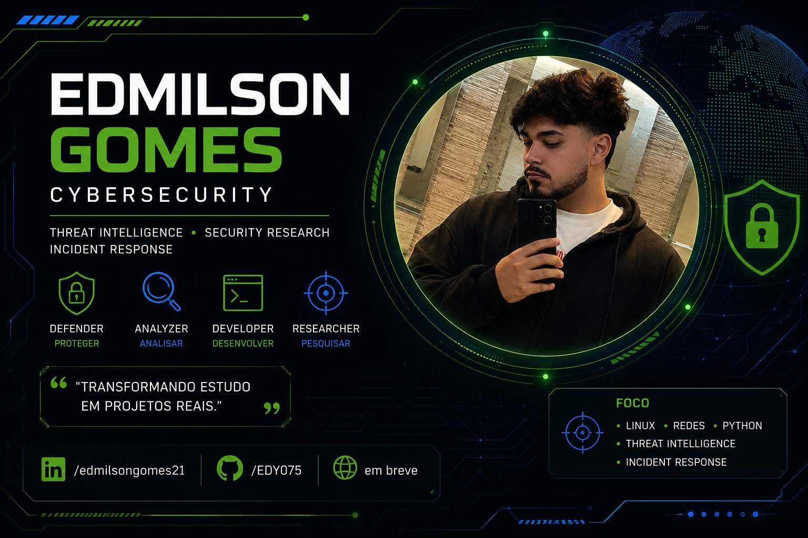



  

 
━━━━━━━━━━━━━━━━━━━━━━━━━━━━━━━━━━━━━━━━━━━━━━

Transformando aprendizado em projetos reais de Cybersecurity.

━━━━━━━━━━━━━━━━━━━━━━━━━━━━━━━━━━━━━━━━━━━━━━
# 🛡️ Edmilson Gomes

### Cibersegurança • Threat Intelligence • Blue Team • Resposta a Incidentes

> Foco em projetos praticos de Defesa, Deteccao e Resposta a Incidentes.

---

## 🛡️ Sobre mim

Sempre tive interesse por tecnologia, mas foi na Segurança da Informação que encontrei a área em que quero construir minha carreira.

Hoje direciono meus estudos para Linux, Redes, Python, Threat Intelligence, Resposta a Incidentes e desenvolvimento de projetos que me permitam aplicar na prática cada novo conhecimento adquirido.

Meu objetivo é evoluir continuamente, transformar aprendizado em experiência prática e contribuir para ambientes mais seguros.

## 💻 Tecnologias

---

## 🛡 Featured Project

## EDY Shield (Projeto Principal)

Plataforma modular de ciberseguranca defensiva em Python 3.12 (core 100% stdlib).

- Dashboard SOC com KPIs e saude do sistema
- Alert Center com triagem e ciclo de vida (ACK/Resolve/Suppress/Reopen)
- Investigation Workspace com timeline, evidencias e historico
- File Integrity Monitor (baseline + scan)
- String/Entropy Analyzer e Log Analyzer
- REST API completa + CLI
- 635 testes - mypy strict - ruff limpo

Repositorio: https://github.com/EDY075/edy-shield

---

## 🛡️ WAR ROOM

🎬 Documentário interativo sobre os maiores ataques cibernéticos da história.

✔ 12 incidentes históricos

✔ Narrativa cinematográfica

✔ Timeline interativa

✔ Galeria de imagens

✔ GitHub Pages

✔ HTML • CSS • JavaScript

🌐 Demonstração:
https://edy075.github.io/WAR_ROOM/

📂 Repositório:
https://github.com/EDY075/WAR_ROOM

🟢 Versão v1.0.0 publicada

Uma plataforma interativa desenvolvida para documentar os maiores ataques cibernéticos da história.

Mais do que apresentar informações, o projeto busca explicar como cada incidente aconteceu, quais impactos causou e quais lições podemos aprender.

Projeto disponível publicamente através do GitHub Pages.

---

## Atualmente explorando

- 🐧 Linux
- 🌐 Redes
- 🐍 Python
- 🛡️ Threat Intelligence
- 🚨 Resposta a Incidentes
- 🔵 Blue Team
- 🔍 SIEM
- 🧾 Forense Digital

## 🎯 Objetivo

Conquistar minha primeira oportunidade na área de Tecnologia e Segurança da Informação enquanto continuo desenvolvendo projetos práticos e expandindo meus conhecimentos.

---

## 📬 Contato

- 💼 LinkedIn
  https://linkedin.com/in/edmilsongomes21

- 💻 GitHub
  https://github.com/EDY075

- Projetos
  https://github.com/EDY075?tab=repositories
---

> "A segurança não é um produto, é um processo de aprendizado contínuo."

