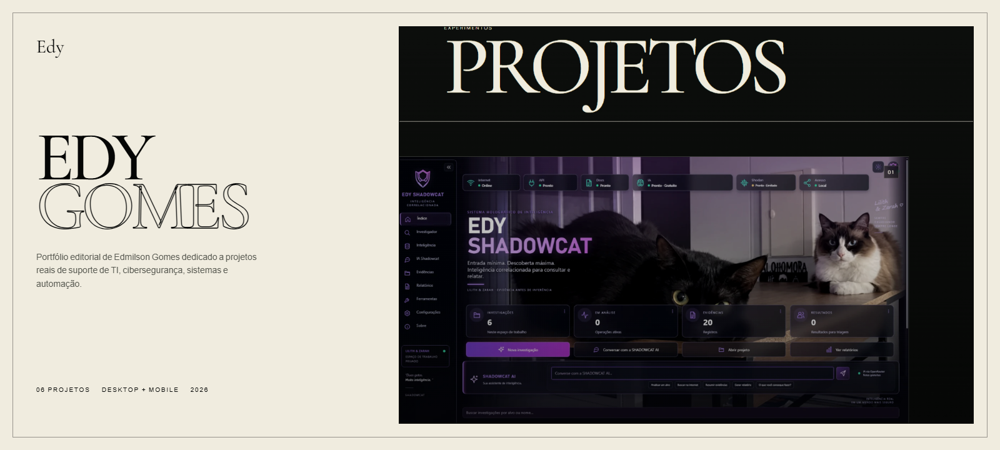
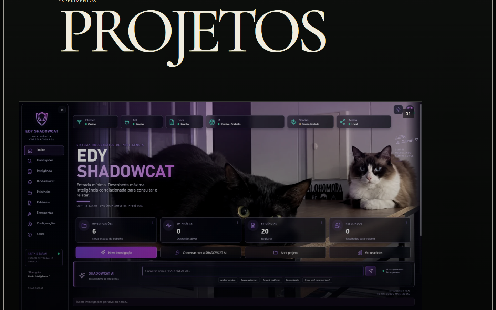
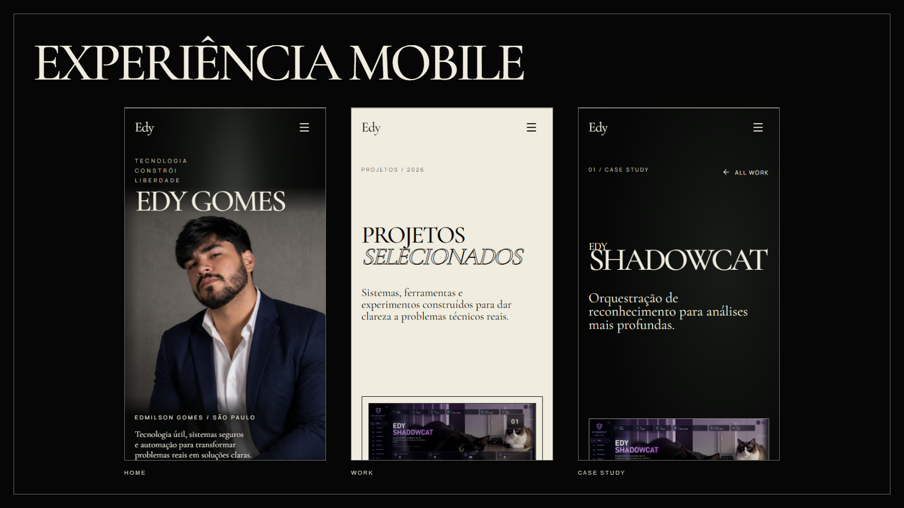

# Edmilson Gomes

**Suporte de TI · Cibersegurança · Automação · Desenvolvimento**

Construindo soluções práticas em suporte, segurança, automação, desenvolvimento e análise de dados.

[Portfólio](https://edy-gomes-portfolio.edy-scanurl-family-worker.workers.dev/) · [LinkedIn](https://www.linkedin.com/in/edmilsongomes21/) · [GitHub](https://github.com/EDY075) · [Contato](mailto:edmilsongsousa20@gmail.com)

---

## SOBRE MIM

Desenvolvo projetos que conectam suporte de TI, segurança, análise, automação, interfaces e documentação. Meu foco profissional parte de operações e resolução de problemas, com foco crescente em SOC / Blue Team e desenvolvimento de soluções local-first.

## PROJETOS SELECIONADOS

### EDY SHADOWCAT

Orquestração local-first de reconhecimento autorizado, correlação de evidências e geração de relatórios.

`Automação de segurança` · `Python` · `FastAPI` · `Streamlit` · `SQLite`\
[Ver case study](https://edy-gomes-portfolio.edy-scanurl-family-worker.workers.dev/work/edy-shadowcat) · Repositório privado

### EDY VERDICT

Workbench local-first para verificar repositórios, binários, aplicativos instalados e URLs por meio de análise passiva.

`Análise de segurança` · `Rust` · `Tauri` · `React` · `SQLite`\
[Ver repositório](https://github.com/EDY075/EDY-VERDICT)

### EDY ScanURL Family

Solução Web, PWA e Android para analisar sinais públicos de lojas e URLs antes de uma compra.

`Segurança Web` · `TypeScript` · `React` · `Vite` · `Cloudflare Workers`\
[Ver repositório](https://github.com/EDY075/edy-scanurl-family)

### EDY HelpDesk

Service Desk local-first com tickets, SLA, ativos, diagnósticos somente leitura, relatórios e fluxos de segurança.

`Suporte de TI` · `TypeScript` · `React` · `Node.js` · `SQLite`\
[Ver repositório](https://github.com/EDY075/EDY-HelpDesk)

### EDY SOC Analytics

Camada analítica de SOC com dados sintéticos, modelo estrela, DAX, RLS, MITRE ATT&CK e validação reproduzível.

`Dados & análise` · `Power BI` · `DAX` · `TMDL` · `Python`\
[Ver repositório](https://github.com/EDY075/EDY-SOC-Analytics)

### EDY RECON

Toolkit offline-first de OSINT e pesquisa de segurança com relatórios TXT/HTML sanitizados e controles defensivos.

`OSINT` · `Python` · `Windows` · `Kali Linux`\
[Ver repositório](https://github.com/EDY075/EDY-RECON)

## CAPACIDADES

- **SUPORTE & OPERAÇÕES** — solução de problemas, hardware e software, atendimento ao usuário, documentação e suporte a endpoints Windows.
- **SEGURANÇA** — SOC / Blue Team, análise de eventos, Threat Intelligence, OSINT e reconhecimento autorizado.
- **DESENVOLVIMENTO** — sistemas, interfaces, APIs e automações com Python, TypeScript, Rust e React.
- **DADOS & ANÁLISE** — Power BI, DAX, dashboards e modelagem de dados.

## TECNOLOGIAS

- **Linguagens** — Python · TypeScript · JavaScript · Rust
- **Interfaces** — React · Vite · Streamlit
- **Backend e dados locais** — FastAPI · Node.js · Express · SQLite
- **Segurança** — Nuclei · BBOT · Recon-ng · OSINT
- **Dados e análise** — Power BI · DAX · TMDL
- **Ferramentas e ambientes** — Git · Docker · Windows · Linux

## PORTFÓLIO EM CONTEXTO

## CONTATO

Aberto a conexões profissionais, oportunidades e projetos.

[Enviar e-mail](mailto:edmilsongsousa20@gmail.com) · [Conectar no LinkedIn](https://www.linkedin.com/in/edmilsongomes21/) · [Conhecer o portfólio](https://edy-gomes-portfolio.edy-scanurl-family-worker.workers.dev/)
